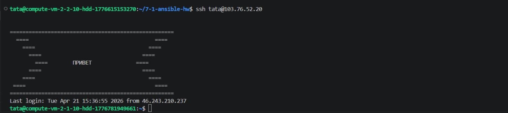
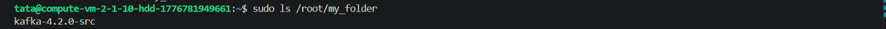
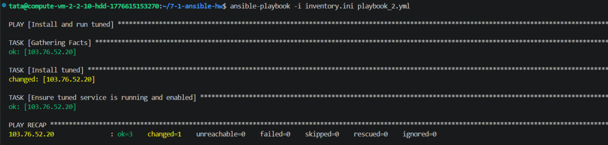
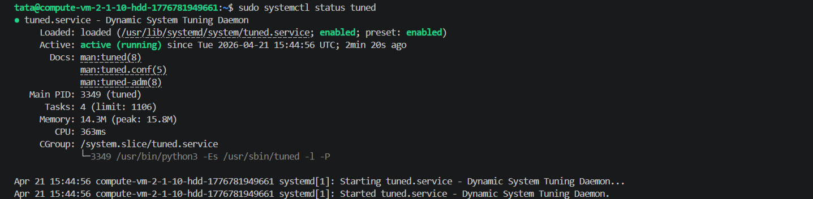

# Домашнее задание к занятию "`Ansible.Часть 2`" - `Фабричникова Татьяна`


### Задание 1

Выполните действия, приложите файлы с плейбуками и вывод выполнения (В yandex cloud создала 2 ВМ)

Напишите три плейбука. При написании рекомендуем использовать текстовый редактор с подсветкой синтаксиса YAML.

Файл inventory.ini
    ```
   [yandex_vm]
   103.76.52.20 ansible_user=tata
    ```

Плейбуки должны:
   1.Скачать какой-либо архив, создать папку для распаковки и распаковать скаченный архив. Например, можете использовать официальный сайт и зеркало Apache Kafka. При этом можно скачать как исходный код, так и бинарные файлы, запакованные в архив — в нашем задании не принципиально.

 Содержание плейбука:
 ```
---
- hosts: yandex_vm
  become: yes
  tasks:

  - name: Create a folder and unpack the archive
    file:
      path: /root/my_folder
      state: directory

  - name: download archive
    get_url:
      url:  https://www.apache.org/dyn/closer.lua/kafka/4.2.0/kafka-4.2.0-src.tgz?action=download 
      dest: /root/kafka.tgz

  - name: Unpack the archive
    unarchive:
      src: /root/kafka.tgz
      dest: /root/my_folder
      remote_src: yes
 ```

      
   >Запуск плейбука

      
   >Распакованный архив 

   2.Установить пакет tuned из стандартного репозитория вашей ОС. Запустить его, как демон — конфигурационный файл systemd появится автоматически при установке. Добавить tuned в автозагрузку.
   Содержание плейбука:
 ```
---
- name: Install and run tuned
  hosts: yandex_vm
  become: yes
  
  tasks:
    - name: Install tuned 
      apt:
        name: tuned
        state: present
        update_cache: yes

    - name: Ensure tuned service is running and enabled
      systemd:
        name: tuned
        state: started
        enabled: yes
 ```
      
   >Запуск плейбука

      
   >Состояние сервиса на управляемом узле

   3.Изменить приветствие системы (motd) при входе на любое другое устройство. Пожалуйста, в этом задании используйте переменную для задания приветствия. Переменную можно задавать любым удобным способом.
   Содержание плейбука:
 ```
---
- name: Changed motd
  hosts: yandex_vm
  remote_user: tata
  become: yes
  
  tasks:
    - name: Disable  MOTD scripts
      shell: chmod -x /etc/update-motd.d/*
    
    - name: Set motd 
      template:
        src: motd.j2
        dest: /etc/motd
 ```
   
        
>Запуск плейбука


### Задание 2

Выполните действия, приложите файлы с модифицированным плейбуком и вывод выполнения.

Модифицируйте плейбук из пункта 3, задания 1. В качестве приветствия он должен установить IP-адрес и hostname управляемого хоста, пожелание хорошего дня системному администратору.

1. `Заполните здесь этапы выполнения, если требуется ....`
2. `Заполните здесь этапы выполнения, если требуется ....`
3. `Заполните здесь этапы выполнения, если требуется ....`
4. `Заполните здесь этапы выполнения, если требуется ....`
5. `Заполните здесь этапы выполнения, если требуется ....`
6. 

```
Поле для вставки кода...
....
....
....
....
```

`При необходимости прикрепитe сюда скриншоты
`


---

### Задание 3

Выполните действия, приложите архив с ролью и вывод выполнения.

Ознакомьтесь со статьёй «Ansible - это вам не bash», сделайте соответствующие выводы и не используйте модули shell или command при выполнении задания.

Создайте плейбук, который будет включать в себя одну, созданную вами роль. Роль должна:

   1.Установить веб-сервер Apache на управляемые хосты.
   2.Сконфигурировать файл index.html c выводом характеристик каждого компьютера как веб-страницу по умолчанию для Apache. Необходимо включить CPU, RAM, величину первого HDD, IP-адрес. Используйте Ansible facts и jinja2-template. Необходимо реализовать handler: перезапуск Apache только в случае изменения файла конфигурации Apache.
   3.Открыть порт 80, если необходимо, запустить сервер и добавить его в автозагрузку.
   4.Сделать проверку доступности веб-сайта (ответ 200, модуль uri).

В качестве решения:
  - предоставьте плейбук, использующий роль;
  - разместите архив созданной роли у себя на Google диске и приложите ссылку на роль в своём решении;
  - предоставьте скриншоты выполнения плейбука;
  - предоставьте скриншот браузера, отображающего сконфигурированный index.html в качестве сайта.

1. `Заполните здесь этапы выполнения, если требуется ....`
2. `Заполните здесь этапы выполнения, если требуется ....`
3. `Заполните здесь этапы выполнения, если требуется ....`
4. `Заполните здесь этапы выполнения, если требуется ....`
5. `Заполните здесь этапы выполнения, если требуется ....`
6. 

```
Поле для вставки кода...
....
....
....
....
```

`При необходимости прикрепитe сюда скриншоты
`

### Задание 4

`Приведите ответ в свободной форме........`

1. `Заполните здесь этапы выполнения, если требуется ....`
2. `Заполните здесь этапы выполнения, если требуется ....`
3. `Заполните здесь этапы выполнения, если требуется ....`
4. `Заполните здесь этапы выполнения, если требуется ....`
5. `Заполните здесь этапы выполнения, если требуется ....`
6. 

```
Поле для вставки кода...
....
....
....
....
```

`При необходимости прикрепитe сюда скриншоты
`
